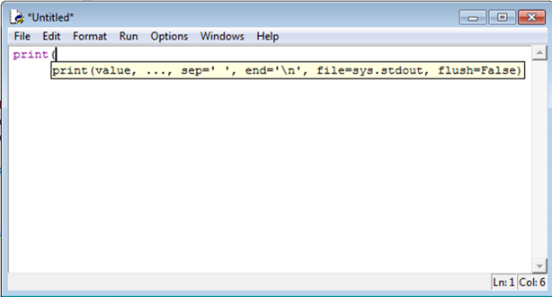
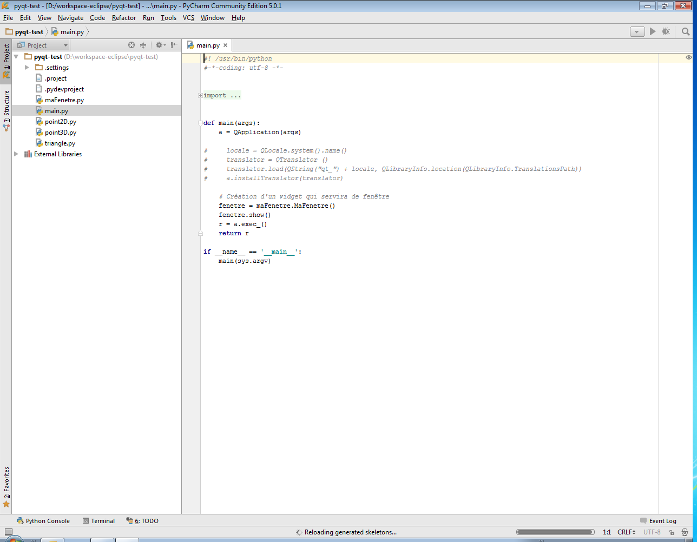
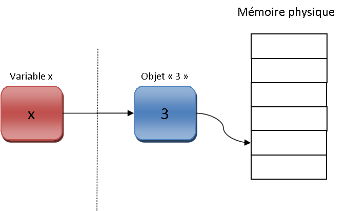
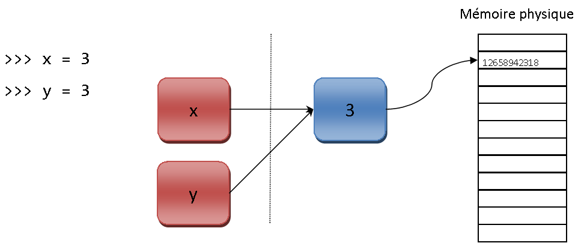
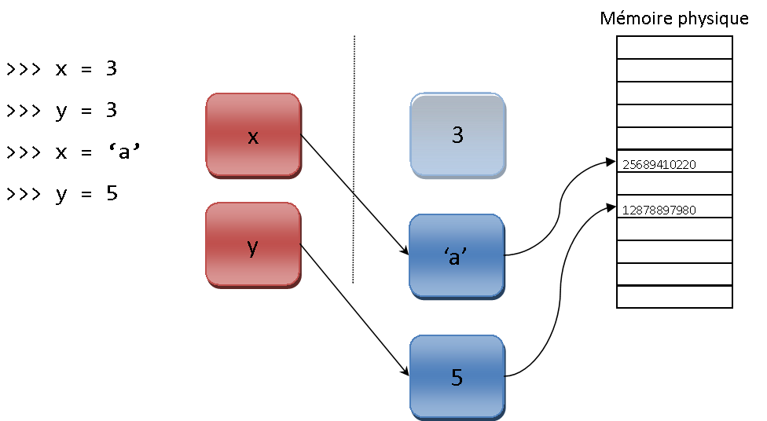

% Programmation avec Python
% Division des enseignements en informatique
% 2016


# Introduction #

## Histoire de Python ##
* 80-90 : Guido van Rossum / Langage ABC 
	* invite de commande interractive avec mémoire
	* pas de point virgule, indentation
* 1991 : première version de Python (0.9.0)
* 1995 : version 1.2
* 2000 : version 2.0
* 2008 : version 3.0 (*rectification de défauts du langage*)
* 2010 : version 2.7
* 2015 : version 3.5

## Distribution de Python ##
* Python Software Fundation
* Licence LGPL (Lesser GNU Public License)
	* Utilisation sans restriction
	* Y compris usages commerciaux 

## Caractéristiques du langage ##
* Python est...
	* Ni interprété, ni compilé
	* Orienté objet et fonctionnel
	* A typage dynamique fort
	* Associable
	* Un langage de haut niveau
	* Facile à lire et à écrire

## Usages de Python ##
* Scripts métier
* Calculs scientifiques
* Applications bureautiques
* Extensions
* Jeux vidéo
* Web

## Exécution d'un programme ##
* Processus d'exécution
	* Code source *compilé* en bytecode
	* Bytecode exécuté par la machine virtuelle Python


* **Interpréteur Python**
	* Programme écrit en C le plus souvent
	* Plusieurs versions possibles sur un même ordinateur


## En pratique ##
* En ligne de commande
	* `python`
	* `py -2`
	* `python script.py`
* Sous windows
	* double clic sur `script.py`

## Environnements de développement ##
* Invite de commande interractive
* IDLE
* IDE : PyScripter, PyCharm, PyDev...
* Notebook Jupyter

## Environnements de développement ##

</br>


## Environnements de développement ##

</br>



## Environnements de développement ##

</br>




# Types et opérations #

## Variables ##
* 1 variable = 1 nom + 1 valeur
	* Règles de nommage
		* Lettes, chiffres et blancs soulignés
		* Pas d'espace, accent, caractère spécial
		* Sensible à la casse
	* Convention

``` python
mon_nom_de_variable
```

</br>
<small> Mots réservés </small>

``` python
and  as  assert  break  class  continue  def  del  
elif  else  except  false  finally  for  from  global  
if  import  in  is  lambda  none  nonlocal  not  or
pass  raise  return  true  try  while  with  yield
```

## Types et variables ##
* Typage dynamique fort
	* Typage **fort**
		* Type derrière chaque variable
		* Opérations cohérentes avec le type
	* Typage **dynamique**
		* Type d'une variable modifiable au cours du programme
* En pratique...
	* Pas de déclaration des types
	* Détections par l'interpréteur
	* Associé à la valeur référencée par la variable

## Affectation ##



## Types et variables ##
* Conséquences
	* Impossible de déclarer une variable sans lui affecter une valeur
	* Types associés aux objets référencés
	* Type d'une variable = type de l'objet référencé

## Affectations et mémoire ##



## Affectations et mémoire ##


## Affectations et mémoire ##



## Affectations en Python ##
* Affectation *simple*

``` python
>>> a = 2
>>> a
2
```

* Affectations parallèles

``` python
>>> a, b = 2, 5
>>> a
2
>>> b
5
```

* Affectations multiples

``` python
>>> a = b = c = 4
>>> a
4
>>> b
4
>>> c
4
```

## Types de base ##
* Types de base ou *types intégrés*

<small style="display: block">

| **Type**     | **Exemple de valeur** |
|:-------------|:----------------------|
| Nombre       | `3`, `1.1456`, `-3.5` |
| Chaîne de caractères | `'mot'`, `'petit texte'` |
| Liste        | `[1, 2, 3]`, `['a', 'b']`, `['a', 5, 2.3, 'f']` |
| Tuple        | `(1, 3)`, `('a', 'b', 14)` |
| Ensemble     | `set('abc')`, `{'a', 'b', 'c'}` |
| Dictionnaire | `{'a': 3, 7: 'b'}`    |
| Fichier      | `open('fichier.txt')` |
| Booléen      | `True`, `False`       |
| Rien         | `None`                |

</small>

## Types numériques ##

| **Type** | **Exemple de valeur** |
|:---------|:----------------------|
| Integer  | `2`, `-3`, `156235789` |
| Float    | `2.3`, `-4.12`, `1.0`, `189489.23891` |
| Complex  | `2+3j`                |
| Decimal  | `Decimal('0.1')`      |
| Fraction | `Fraction(1, 3)`      |

## Opérations sur les numériques ##
* Opérations *classiques*
	* Addition `+`
	* Soustraction `-`
	* Multiplication `*`
	* Puissance `**`
	* Division `/`
	* Division entière `//`
	* Reste d'une division entière (*modulo*) `%`

## Les nombres entiers et réels ##

* 2 types distincts

``` python
>>> a = 3
>>> type(a)
<class 'int'>
>>> b = 3.0
>>> type(b)
<class 'float'>
```

* Conversion automatique vers le plus "complèxe"

``` python
>>> a = 3 + 2.18
>>> a
5.18
>>> type(a)
<class 'float'>
```

## Les nombres entiers et réels ##

* `int()` et `float()` pour convertir

``` python
>>> a, b = 14, 4
>>> c = a % b
>>> c
2
>>> d = float(c)
>>> d
2.0
```

## Les booléens ##
* `True` ou `False`
* *Surcouche* des entiers 0 et 1
* Résultats des opérations logiques

<small style="display: block">

| **Opérateur** | **Signification** |
|:-------------:|:------------------|
| `<`           | Inférieur         |
| `>`           | Supérieur         |
| `>=`          | Supérieur ou égal |
| `<=`          | Inférieur ou égal |
| `==`          | Egal              |
| `!=` ou `<>`  | Différent de      |
| `is`          | Objet identique   |
| `is not`      | Objet différent   |

</small>

## Les booléens ##

* Exemple 1

``` python
>>> True + 2
3
```

</br>

* Exemple 2

``` python
>>> x = (3 != 5)
>>> x
True
```

## Le type Rien ##
* `None`
* Référence **l'objet rien**

``` python
>>> x = None
>>> type(x)
<class 'NoneType '>
```

## Les séquences ##
* Catégorie de structures avec des propriétés communes
	* **itérable** : retourner les éléments qui la compose les uns à la suite des autres
	* **indexable** : retourner n'importe lequel de ses éléments sans avoir à la parcourir en entier
* 2 grandes catégories
	* séquence **immuable** (= non modifiable)
	* séquence **mutable** (= modifiable)
* 3 types *basiques*
	* liste
	* tuple
	* range

## Opérations sur les séquences ##

<small style="display: block">

| **Opération** | **Signification**                               |
|:--------------|:------------------------------------------------|
| `s + t`       | concaténation de s et t                         |
| `s * n`       | concaténer n fois s à elle-même                 |
| `s[i]`        | élément à la i-ème position                     |
| `s[i:j]`      | sous-séquence de s, de la i-ème à la j-ème position |
| `s[i:j:k]`    | sous-séquence de s, de la i-ème à la j-ème position avec un pas de k |
| `len(s)`      | nombre d'éléments de s                          |
| `min(s)`      | plus petit élément de s                         |
| `max(s)`      | plus grand élément de s                         |
| `sum(s)`      | somme des éléments de s                         |
| `x in s`      | x est dans s                                    |
| `x not in s`  | x n'est pas dans s                              |
| `s.index(x)`  | position de la première occurence de x dans s   |
| `s.count(x)`  | nombre d'occurrences de x dans s                |

</small>

## Les tuples ##
* Tableaux non modifiable d'objets de n'importe quel type
	* Séquences immuables
* Syntaxe :

``` python
>>> t = elem1, elem2, elem3...
```

* Pour faciliter la lecture : utilisation de parenthèses

``` python
>>> t = (elem1, elem2, elem3...)
```

* Séquence vide : `s = ()`
* Séquence de un élément : `s = elem,` ou `s = (elem,)`

## Les tuples ##
* Exemple

``` python
>>> t = "ing", 16, "ENSG"
>>> t[0]
"ing"
>>> t[0:3:2]
("ing", "ENSG")
>>> 16 in t
True
>>> len(t)
3
>>> t2 = t + (42,)
>>> t2
("ing", 16, "ENSG", 42)
```

## Les listes ##
* Tableaux modifiable d'objets de n'importe quel type
	* Séquences mutable
* Syntaxe :

``` python
>>> l = [elem1, elem2, elem3...]
```

* Liste vide : `l = []`
* Liste de un élément : `l = [elem]`

## Opérations sur les listes ##

<small>

| **Opération**      | **Signification**          |
|:-------------------|:---------------------------|
| `l[i] = x`         | élément à la position i remplacé par x |
| `l[i:j] = t`       | séquence entre les position i et j remplacée par la liste t |
| `l.extend(t)`      | ajout de la séquence t à L |
| `l.append(x)`      | ajout de x à la fin de L   |
| `l.insert(i, x)`   | insertion de x à la position x |
| `l.pop(i)`         | retourne et supprime de la liste l'élément à la position i |
| `del(l[i:j])`      | suppression des éléments entre les position i et j |
| `l.clear()`        | vide la liste              |
| `l.reverse()`      | inverse l'ordre des éléments de L|
| `l.sort()`         | trie les éléments de L par ordre croissant |

</small>

## Les listes ##
* Exemple

``` python
>>> liste = [2, 4, 3, 1, 5, 8]
>>> liste[2] = 7
>>> liste
[2, 4, 7, 1, 5, 8]
>>> liste.append(1)
[2, 4, 7, 1, 5, 8, 1]
>>> liste.reverse()
>>> liste
[1, 8, 5, 1, 7, 4, 2]
>>> len(liste)
7
>>> liste.pop(4)
7
>>> liste
[1, 8, 5, 1, 4, 2]
```

## Les ranges ##
* Suite de nombres entiers
	* Séquence immuable
* Définie par 
	* **borne finale**
	* et éventuellement : **borne initiale** et **pas**
* Syntaxe :

``` python
>>> r = range(bi, bf, pas)
```

* Peut être convertie en liste :

``` python
>>> l = list(range(2, 5))
>>> type(l)
<class 'list'>
>>> l
[2, 3, 4]
```

## Les chaînes de caractères ##
* Type particulier de séquence immuable
* Suite finie de caractères
* Pas de distinction caractère / chaîne de caractères
* Définie entre guillements ou apostrophes

``` python
>>> "demain" == 'demain'
True
```

## Les chaînes de caractères ##
* Opérateurs : + / * / in / not in / [i] / [i:j]
* Fonctions : 
	* `isalpha()`
	* `isdigit()`
	* `replace(old, new)`
	* `split(sep)`
	* `upper()`
	* `endwith()`
	* `startwith()`

## Les chaînes de caractères ##
* Exemple

``` python
>>> a = "12 avenue de Paris"
>>> a[5]
e
>>> a.count(" ")
3
>>> a.isalpha()
False
>>> mots = a.split(" ")
>>> mots
['12', 'avenue', 'de', 'Paris']
>>> mots[1].upper()
'AVENUE'
>>> mots[1] = mots[1].upper()
>>> mots
['12', 'AVENUE', 'de', 'Paris']
```

## Les dictionnaires ##
* Association non ordonnée et modifiable de clés et de valeurs
* *Tables d'associations*

``` python
>>> dico = {cle1: valeur1, cle2, valeur2...}
```

* Dictionnaire vide : `{}`
* Remarque :
	* Liste = ensemble d'éléments référencés par leur position
	* Dictionnaire = ensemble d'éléments référencés par d'autres éléments immuables

## Opérations sur les dictionnaires ##

<small style="display: block">

| **Opération** | **Signification**                               |
|:--------------|:------------------------------------------------|
| `d[cle]`      | élément associé à la clé cle                    |
| `len(d)`      | nombre d'éléments de d                          |
| `x in d`      | x est dans d                                    |
| `x not in d`  | x n'est pas dans d                              |
| `del(d[cle])` | suppression de l'élément associé à la clé cle   |
| `d.items()`   | retourne une liste de couples (cle, valeur)     |
| `d.keys()`    | retourne la liste des clés                      |
| `d.values()`  | retourne la liste des valeurs                   |
| `d.update(d2)`| ajoute le dictionnaire d2 à d                   |
| `d.clear()  ` | vide le dictionnaire                            |

</small>

## Les dictionnaires ##
* Exemple

``` python
>>> dico = {"nom": "Mir", "prenom": "Jade", "age": 24}
>>> dico["nom"]
'Mir'
>>> dico["prenom"] = "Abel"
>>> dico
{'prenom': 'Abel', 'age': 24, 'nom': 'Mir'}
>>> dico["animaux"] = ["chien", "poissons"]
>>> dico
{'prenom': 'Abel', 'animaux': ['chien', 'poissons'], 'age': 24, 'nom': 'Mir'}
>>> dico.keys()
['prenom', 'animaux', 'age', 'nom']
```

## Les ensembles ##
* Collection non ordonnée d'objets
* Propriétés
	* Itérable
	* Modifiable
	* Supporte propriétés mathématiques des ensembles
* Mais
	* Non indexable
	* Pas d'élément en double

``` python
>>> s = set('abracadabra')
>>> s
{'a', 'd', 'b', 'r', 'c'}
```

## Les fichiers ##
* Ouverture : `f = open(chemin, mode)`
	* 3 modes combinables
		* Lecture `'r'`
		* Ecriture `'w'` (*écrase le contenu précédent*)
		* Ajout `'a'`
* Fermeture **indispensable** : `f.close()`
* Options de lecture
	* En entier : `f.read()`
	* Ligne par ligne : `f.readline()`
	* ...
* Ecriture
	* `f.write(message)`

## Les fichiers ##
* Exemple de lecture

``` python
>>> fichier = open(r"D:\TD_Python\fichier.txt", "r")
>>> contenu = fichier.read()
>>> fichier.close()
>>> print(contenu)
Je suis le contenu d'un fichier texte !
```

* Exemple d'écriture

``` python
>>> fichier = open("fichier.txt", "w")
>>> fichier.write("J'écris dans un fichier texte via Python")
>>> fichier.close()
```

# Syntaxe du langage #

## Structure du code ##
* 1 ligne = 1 instruction
* Pas de symbole de fin d'instruction
	* Indentation pour structurer le code
* Sauts de lignes et espaces ignorés
* Lignes non lues par l'interpréteur
	* Commentaires : `# ...`
	* Documentation (*docstring*) : `""" ... """`

``` python
# commentaire sur une ligne

""" 
Documentation 
sur plusieurs
lignes 
"""
```

## Les tests ##
* Pas de structure de tests à choix multiple
* Syntaxe :

``` python
if condition:
	instruction1
	instruction2
	...
else:
	instructionA
	...
```

* Exemple :

``` python
if x >= 0:
    print("x positif")
else:
	print("x negatif")
```

## Les tests ##
* Tester plusieurs conditions
	* `elif`

``` python
if x % 2 == 0:
    print("x multiple de 2")
elif x % 3 == 0:
	print("x multiple de 3")
elif x % 5 == 0:
	print("x pultiple de 5")
else:
	print("x n'est multiple ni de 2, ni de 3, ni de 5")
```

## Les tests ##
* Ecritures simplifiées

| **Valeur** | **Test**    | **Test simplifié** |
|:----------:|:------------|:-------------------|
| None       | if v==None: | if not v:          |
|            | if v!=None: | if v:              |
| Booléen    | if v==True: | if v:              |
|            | if v==False: | if not v:         |
| Zéro       | if v==0:    | if not v:          |
|            | if v!=0:    | if v:              |

## Les boucles ##
* Deux types de boucles
	* For
	* While

## Boucle while ##
* Syntaxe :

``` python
while condition:
    instruction1
    instruction2
    ....
```

* Exemple :

``` python
>>> a = 0
>>> while a <= 3:
... 	print(a)
... 	a += 1 
...
0
1
2
3
```

## Boucle for ##
* Syntaxe :

``` python
for element in iterable:
	instruction1
    ...
```

* Exemple :

``` python
>>> for i in range(1, 4):
...    print(i**2)
...
1
4
9
```

## Sorties de boucle ##
* 2 débranchements
	* Sortie définitive : `break`
	* Retour au début du bloc de code : `continue`

``` python
>>> for i in range (3) :
... 	print ("Début du bloc")
... 	continue
... 	print ("Fin du bloc")
...
Début du bloc
Début du bloc
Début du bloc
```

## Les listes de compréhension ##
* Création d'une liste à partir d'un traitement sur une autre liste

``` python
liste = [ instruction for element in iterable if condition ]
```

* Exemple 

``` python
>>> liste = [ x**2 for x in range(5) ]
>>> liste2
[0, 1, 4, 9, 16]
```

# Modules et fonctions #

## Les fonctions ##
* Groupe d'instructions destiné à être exécuté plusieurs fois
* Des paramètres pour faire varier les conditions initiales
* Une unique valeur de sortie
* Syntaxe

``` python
def ma_fonction(param1, param2, ...):
	instruction1
	instruction2
	...
	return sortie
```

## Les fonctions ##
* Exemple

``` python
>>> def puissance(nombre, facteur):
... 	resultat = nombre ** facteur
... 	return resultat
...
>>> x = puissance(2, 3)
>>> x
8
```

## Valeur par défaut ##
* Paramètre optionnel avec une valeur par défaut
	* `param = valeur_par_defaut`
* Exemple

``` python
>>> def puissance(nombre, facteur=2):
... 	resultat = nombre ** facteur
... 	return resultat
...
>>> x = puissance(2)
>>> x
4
>>> y = puissance(2, 3)
>>> y
8
```

## Portée des variables ##
* local / global
* ne pas utiliser de global


## Fonctions et types modifiables ##
listes (et autres types modifiables) en paramètre 


## Paramètres additionnels ##
args, kwargs


## Les modules ##
import module
import module as alias

from module import element
from module import *

exemples de modules : os, math, random 

## Exceptions ##


# Documentation et tests #


