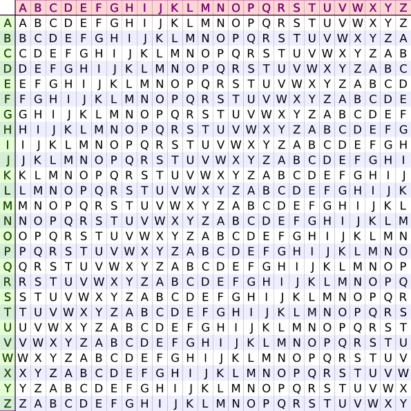

% TP Cryptographie
% Division des enseignements en informatique
% 03/11/2016

Dans ce TP, nous nous proposons de mettre en oeuvre quelques méthodes de cryptage d'une chaîne de caractères. Dans un premier temps, nous écrirons les fonctions nécessaires au cryptage/décryptage. Puis en fin de TP, nous explorerons quelques méthodes permettant de casser un cryptage sans connaître la clé utilisée ou même la méthode de cryptage.

A plusieurs reprise dans ce TP, nous chercherons à déterminer si un caractère est une lettre (a-z) ou autre chose (espace, signe de ponctuation). Pour cela, nous utiliserons le code ASCII du caractère et vérifierons s'il est compris entre 97 et 123 inclus. Deux méthodes nous seront utiles pour cela :

* `ord(string)` transforme un caractère en son code ASCII correspondant;
* `chr(int)` transforme un entier en son caractère ASCII correspondant.

**Restrictions** : nous n'utiliserons au cours de ce TP que des chaînes de caractères écrites en minuscules et sans caractères accentués, l'objectif étant de crypter des messages et d'en retrouver le sens lors du décryptage. 

Dans la pratique, le passage d'un chaîne avec accents et majuscules vers une chaîne "simple" est réalisable en Python (fonction `lower()`, module `unicodedata`), ce qui rend nos programmes compatible avec n'importe quelle donnée en entrée.

# Cryptage de César #
Le cryptage de César est une méthode chiffrement par décalage constant. Chaque lettre du texte en clair est remplacée par une lettre à distance fixe. Dans le cas d'un décalage à droite pour les dernières lettres de l'alphabet, nous repartons au début (et inversement pour un décalage à gauche).

Par exemple avec un décalage de 4 vers la droite, A devient E, B devient F... jusqu'à V qui devient Z, puis W devient A, etc.

Exemple :

Avec un décalage de 4 :

| **Texte en clair** | l'informatique c'est de la balle! |
|:-------------------|:----------------------------------|
| **Texte chiffré**  | p'mrjsvqexmuyi g'iwx hi pe feppi! |

1. Ecrivez une fonction `codage_cesar(message, decalage)` qui applique un décalage constant à toutes les lettres du message en entrée et retourne un message crypté.
2. Prévoyez la fonction inverse qui permet de décoder un message crypté, le décalage étant connu.
3. En comparant vos deux fonctions de cryptage/décryptage, proposez une amélioration du code.

# Cryptage par substitution mono-alphabétique #
Le chiffrement par substitution remplace une lettre par une autre de l'alphabet, mais contrairement au cryptage de César, le décalage n'est plus le même pour toutes les lettres. Cette méthode utilise une clé de chiffrement. Chaque lettre du message à coder est remplacée par sa suivante dans la clé. Pour que la transformation soit bijective, il est nécessaire qu'une lettre n'apparaisse qu'une seule fois dans la clé. Celle-ci sera donc normalisée avant de crypter le message.

Exemple :

Clé : ensg geomatique

Clé normalisée : ensgomatiqu
 
| **Texte en clair** | l'informatique c'est de la balle! |
|:-------------------|:----------------------------------|
| **Texte chiffré**  | l'qsfmratiquen c'ngi dn lt btlln! |

1. Ecrivez une méthodes `normalisation_cle(cle)` retournant une chaîne de caractères contenant la clé normalisée.
2. Ecrivez une fonction `cryptage_substitution(message, cle, mode)` permettant d'effectuer le cryptage ou le décryptage, selon le mode choisi, du message passé en paramètre.

# Cryptage de Vigenère #
Le cryptage de Vigenère est un système de cryptage utilisant un chiffrement par substitution, mais une lettre du message clair peut, suivant sa position, être remplacée par des lettres différentes dans le message chiffré. Le chiffrement repose sur un table de Vigenère et l'utilisation d'une clé connue du codeur et du décodeur. 

La table de Vigenère est constituée d'un alphabet recopié 26 fois et décallé à chaque ligne d'une lettre vers la gauche.

La clé utilisée est écrite sous le texte à chiffrer. Puis pour crypter, nous sélectionnons, pour chaque lettre du texte en clair, la colonne correspondante et nous regardons l'intersection avec la ligne de la lettre de la clé.

Exemple :

* Clé = ensg
* Texte = l'informatique c'est de la balle !

| **Texte en clair** | l'informatique c'est de la balle! |
|:-------------------|:----------------------------------|
| **Clé répétée**    | e'nsgensgensge n'sge ns ge nsgen! |

La première lettre, colonne "l", est codée avec la ligne "e" : on obtient "p".

Le cryptage complet de la chaîne donne :

| **Texte en clair** | l'informatique c'est de la balle! |
|:-------------------|:----------------------------------|
| **Texte chiffré**  | p'vflseegxviai p'wyx qw re osrpr. |

1. Ecrivez une fonction `table_vigenere()` retournant une table de Vigenère sous forme d'un liste de listes.
2. Ecrire une fonction `lettre_codee(lettre, lettre_cle, table_vigenere)`, qui prend une lettre du message et une lettre de la clé et retourne la lettre codée en utilisant la table de Vigenère.
3. Ajoutez une fonction `cryptage_vegenere(message, cle, table_vigenere)` qui a pour paramètres le message à coder, la clé utilisée pour le chiffrement et une table de Vigenère, et retourne le message codé.
La fonction doit parcourir une à une les lettres du texte à coder, les associer à la lettre de la clé et la remplacer par la lettre codée en utilisant la fonction codée à la question précédente.
4. Prévoyez également la fonction inverse de la précédente pour décrypter un message à partir d'une clé et d'un message crypté.

# Cassage de codes #
Dans cette partie, nous cherchons à décrypter un message, sans connaître la clé utilisée lors du cryptage.

Pour cette partie, nous avons traduit un même message à l'aide des trois méthodes étudiées prcédement. Les résultats sont les suivants :

* `a = "p'vflseegxviai p'wyx qw re osrpr. gt c ssox qwy xemiw cjgxviaif egmf xgyg soqrj rif egxuéegxviaif."`
* `b = "p'mrjsvqexmuyi g'iwx hi pe feppi. sr c jemx hiw xvygw tvexmuyiw qemw jeyx emqiv piw qexléqexmuyiw."`
* `c = "l'qsfmratiquen c'ngi dn lt btlln. ms y cmdn dng irecg prtiqueng atqg ftei tqanr lng atihéatiqueng."`

1. Quelle est la lettre la plus fréquente dans la langue française? En quoi cette information nous sera utile pour tenter de casser le cryptage d'un message.
2. Quelle structure de données en Python est particulièrement adaptée pour stocker une analyse de fréquence d'apparition de lettres dans un texte? Codez une fonction d'analyse fréquentielle d'un texte retournant la structure de données identifiée.
3. En supposant que la lettre la plus fréquente dans le texte en clair correspond à celle que vous avez identifé question 1, écrivez une méthode prennant en paramètres un texte codé et le résultat de l'analyse fréquentielle et retournant une proposition de texte décodé. 
4. Sans forcément aboutir à un résultat clé en main, proposez une méthode itérative permettant d'approcher le décryptage d'une clé codée avec la méthode de cryptage de par substitution.

# Aller plus loin #
Le déchiffrage d'un message crypté selon la méthode de Vigenère repose sur une analyse des fréquences d'apparitions de groupes de lettres dans le message codé. Dans la plupart des cas, une séquence de caractères redondant dans le message crypté indique que la même partie de la clé à été utilisée pour chiffrer le message original.

En regardant les distances entre les répétitions des différentes séquences retrouvées, et en charchant le diviseur commun de ces distances, il nous est possible de retrouver la longueur de la clé utilisée.

La longueur de la clé ainsi trouvée, il est possible de découper le texte en autant de groupes que la longueur de la clé. Pour chacun des groupes nous sommes ramené à un chiffrement selon la méthode de César qu'une analyse fréquentielle permet de casser.

*Plus d'info : * <https://fr.wikipedia.org/wiki/Cryptanalyse_du_chiffre_de_Vigen%C3%A8re>

1. Proposez une méthode de forcage d'un texte crypté selon la méthode de Vigenère.

